# Demo - HDInsight Processing Web Log Data
This guide provides steps to setup and demonstrate processing web log data using HDInsight.

## Pre-Requisites
This section lists the pre-requisites required for this demonstration.
-   An Azure subscription
-   HIVE ODBC driver <http://go.microsoft.com/fwlink/?linkid=286698&clcid=0x409>
-   Microsoft Excel (Office 2013 or later)
-   Power Pivot for Excel

## Setup
*Estimated time: 30 minutes*

### Create HDInsight Cluster
1.  Sign-in to the Azure Portal at <https://portal.azure.com>.                               
2.  Select **+NEW &gt; Data + Analytics &gt; HDInsight**. 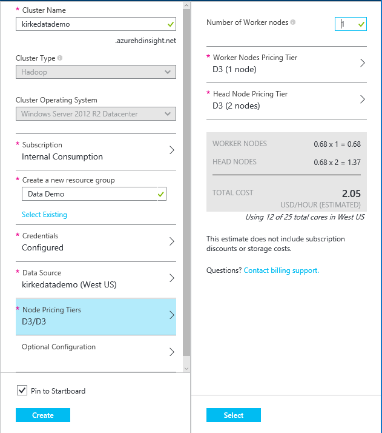                                    
     a.  Provide a unique cluster name                                                         
     b.  Set the Cluster Type to **Hadoop**                                                    
     c.  Set the Cluster Operating System to **Windows**                                       
     d.  Provide a resource group.                                                             
     e.  Set the cluster credentials. Do not forget these.                                     
         i.  Provide a strong password                                                         
         ii.  Remote desktop is not needed for this demo                                        
     f.  Provide a data source.                                                                
         i.  For Selection Method, choose “from all subscriptions”                             
         ii.  Choose or create a storage account.                                               
         iii.  Enter a container name                                                            
         iv.  Choose the location                                                               
     g.  Choose Node Pricing Tiers                                                             
         i.  Number of worker nodes: **1**                                                     
         ii.  Choose a pricing tier. The default is a **D12** size.                             
                                                                                               
 *Remember to remove the HDInsight cluster after you are done with the demo to reduce costs.*

### Install HIVE ODBC driver
1. Download and install the HIVE ODBC driver from <http://go.microsoft.com/fwlink/?linkid=286698&clcid=0x409>
2. Open Excel.                                                                              
3. Go to **File / Options** and choose the **Add-Ins** tab.                                  
4. Change the drop-down to **COM Add-Ins** and click **Go.**

    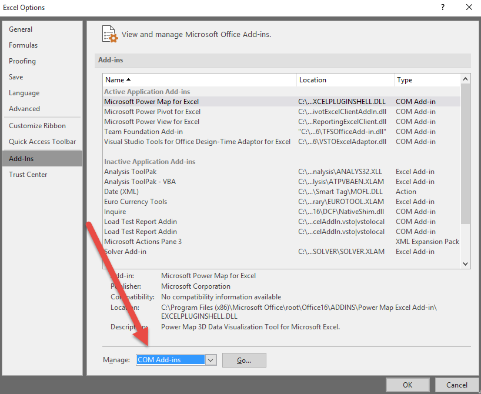
5. Enable the **Microsoft Power Pivot for Excel** option.

    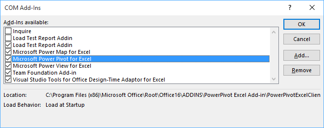

## Demo Steps
*Estimated time: 10 minutes*
1.  Sign-in to the Azure Portal at <https://portal.azure.com>.
2.  Click on **HDInsight Clusters** in the left navigation.
3.  Click on the resource group name

    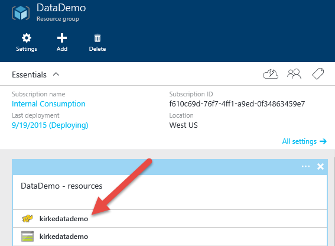
4.  Point out that HDInsight is a resource and you can apply RBAC and tags to the resource group or resource.
5.  Click on the cluster that you previously created.

    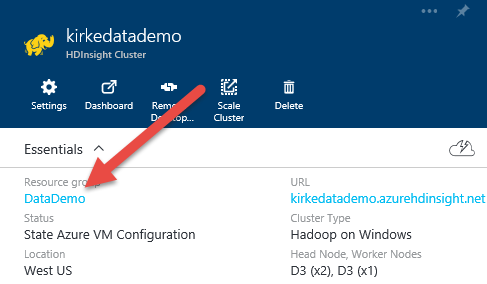
6.  Click on the QuickStart link.

    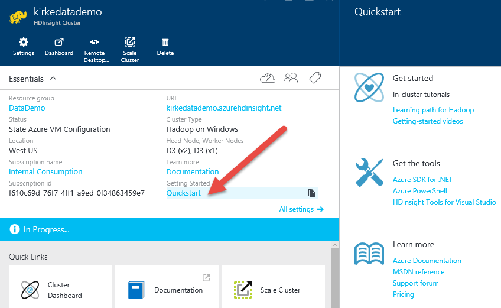
7.  Point out getting started resources.
8.  Click on the Cluster Dashboard.
9.  Provide the credentials that you used when you created the cluster.
    *Note: make sure you get the credentials correct here. It will cache them in the browser and not re-prompt you. *
10.  Point out the cluster dashboard provides links for the Hive Editor, viewing Job History, a File Browser, Hadoop UI, and Yarn UI.
11.  Point out the sample solutions that use your own Azure data.
12.  Point out the sample solutions that use sample data.
13.  Click on the Website Log Analysis sample.

     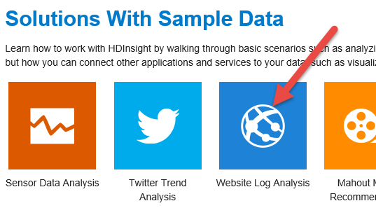
14.  Point out the introduction and what the sample does.
     a.  See the frequency of visits to the website in a day from external websites, and a summary of website errors that the users experience.
     b.  Connect to an Azure Storage Blob using WASB (**Windows Azure Storage Blob**) protocol.
     c.  Create HIVE tables to query the logs
     d.  Create HIVE queries to analyze data
     e.  Connect to HDInsight using ODBC to retrieve the data
15.  Click on prerequisites to show the link to the Hive ODBC driver
16.  Click on step 3 to show the WASB link.
17.  Click on the File Browser link in the console and navigate to \\HdiSamples\\WebsiteLogSampleData\\SampleLog to show the sample W3C log file.

     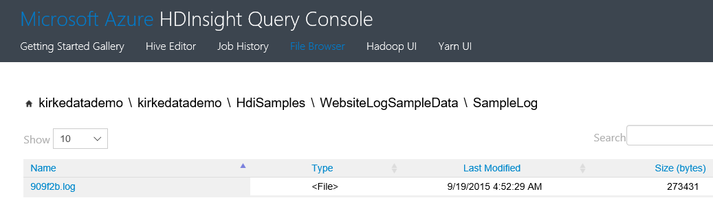
18.  Click on the log file to download and show its contents.

     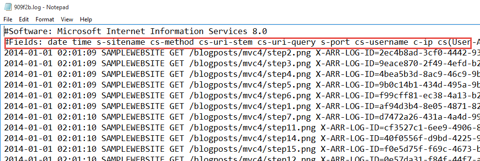
19.  Click the browser’s back button to go back to the Website Log Analysis demo steps.    
20.  Click step 4 to show the SQL-like syntax that Hive uses to create a table called **weblogs**.
21.  Point out that it uses the same WASB file link shown previously, this is how it will access the data during analysis.

     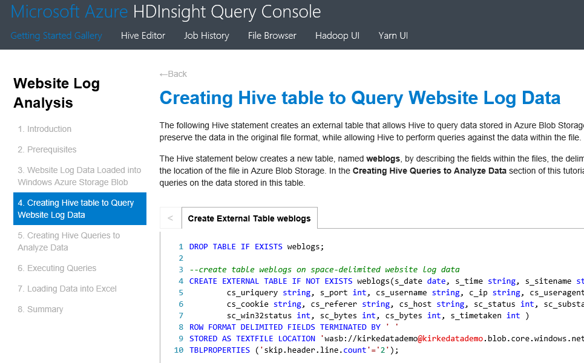
22.  Click step 5 to show the SQL-like syntax that Hive uses to create the **clienterrors** table and the **refersperday** table.

     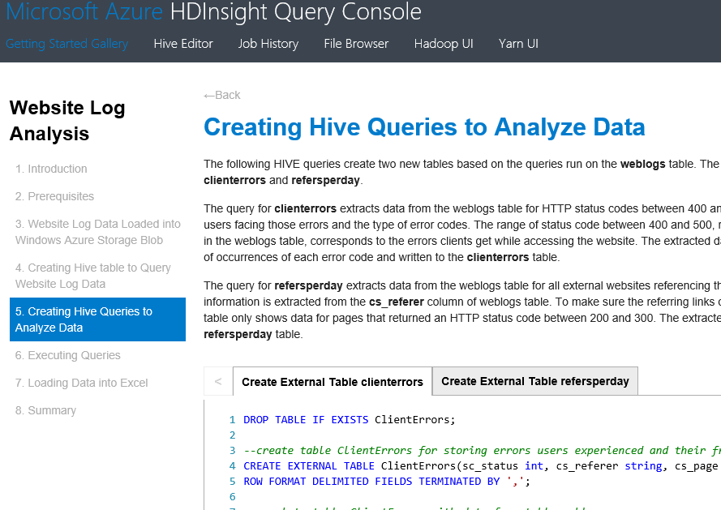
23.  These queries read from the weblogs table created in the previous step to produce different views of semi-structured data.
24.  Click step 6 to show that the Hive queries from the 3 previous steps are all included, and you will submit a job to process all of them at once.                                                                                                                                                       
25.  Click the **Submit** button to start processing.

     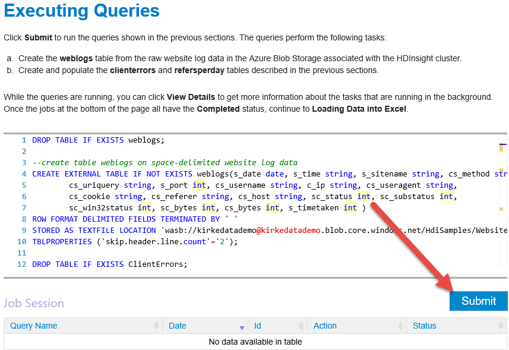
26.  The job will appear in the table.  

     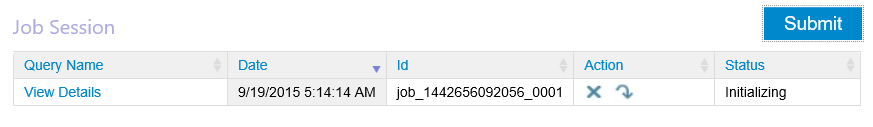          
27.  **RIGHT-CLICK** the job name and choose **Open Link in New Tab**.

     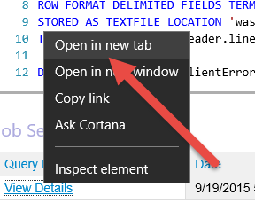
28.  Show the Job log details.

     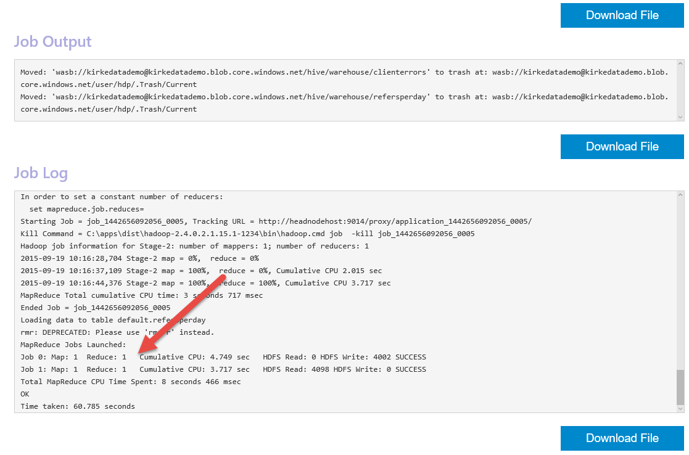
29.  Switch tabs back to the Website Log Analysis demo steps.
30.  Click step 7, Loading Data Into Excel.
31.  Follow the steps to load data from Excel, walking the attendees through the demo.
32.  Open Excel. Choose the Data tab, **From Other Sources**, and choose Microsoft Query.

     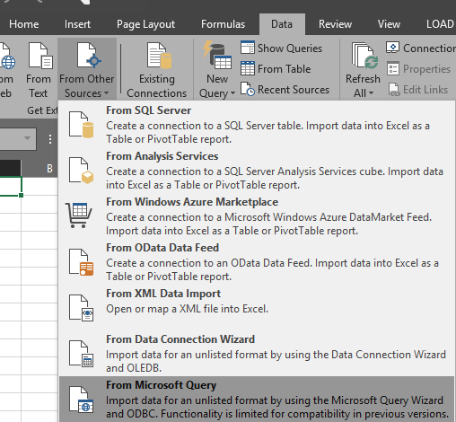
33.  When prompted for Data Source, choose **Sample Microsoft Hive DSN**

     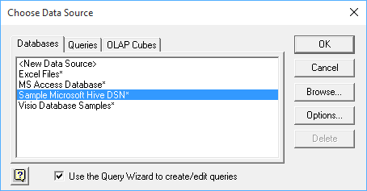
34.  Enter your HDInsight cluster name (ex: kirkedatademo.azurehdinsight.net) as the host.
35.  Enter your credentials for the cluster.

     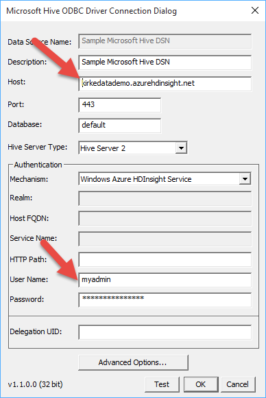
36.  Click **Test** in the connection dialog.

     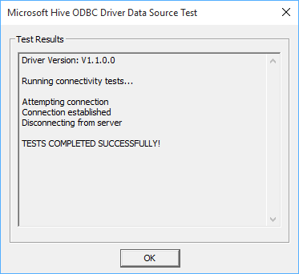
37.  In the Choose Columns dialog, choose **refersperday** and select all columns.

     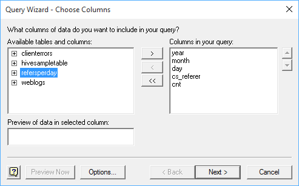
38.  Click Next, Next, Next, Finish to return the data to Microsoft Excel.

     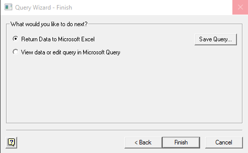
39.  Click OK to import the data as a table.

     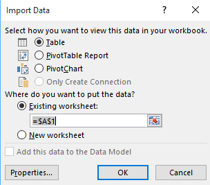
40.  Show the table data.
41.  Explain that this data came from IIS web logs that were ingested to Azure storage and processed using HDInsight. That data can be accessed using existing tools such as Excel using ODBC.

     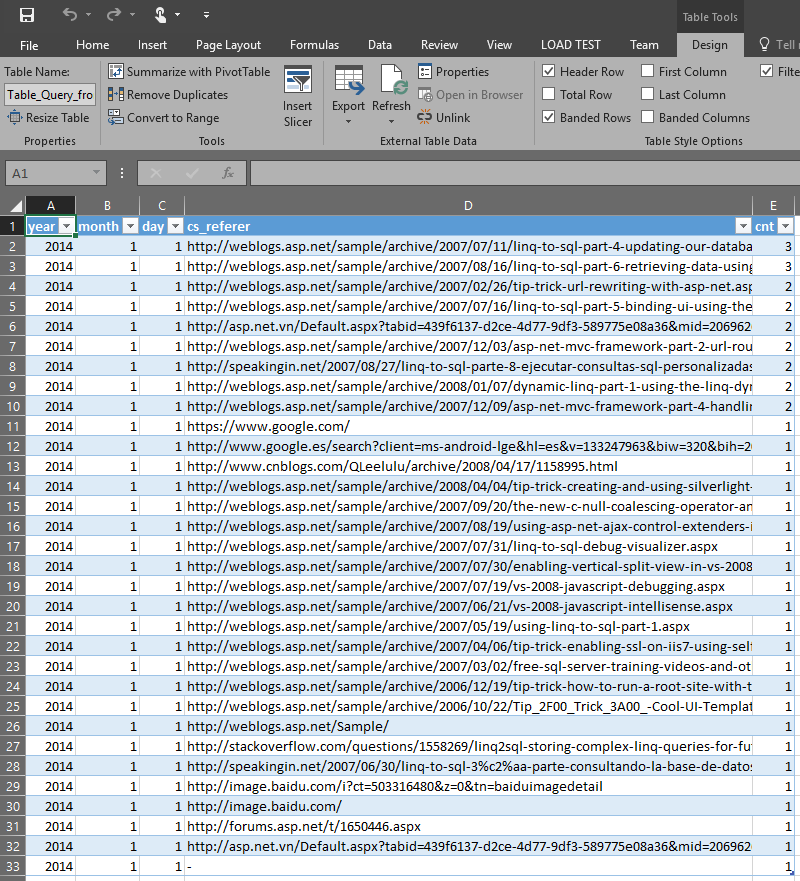
42.  Add a new connection using the same steps as before, this time choosing the **clienterrors** table.
43.  On the **Import Data** screen, choose **PivotTable Report**.

     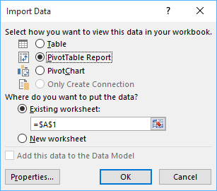
44.  In the PivotTable Fields selector, choose **cs\_referer**, cs\_page, sc\_status, and cnt.
45.  Move cs\_referer and cs\_page to Rows.
46.  Move sc\_status to Columns.

     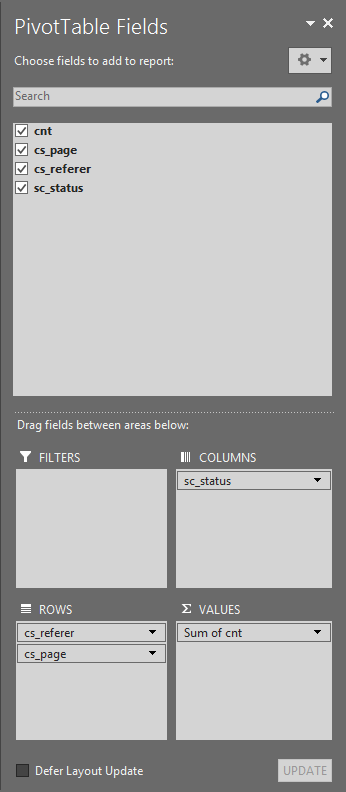
47.  Show that you just created a table that shows the errors per page by referrer, useful when migrating content on a website to make sure you don’t break referral links.                    
48.  This is a great demonstration of self-service BI.

     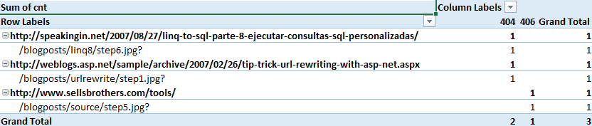
49.  Click the PivotTable. On the **Analyze** tab, click **PivotChart**.
50.  Select the bar chart. On the PivotChart fields option, uncheck the cs\_page option to show how you can quickly provide graphs from semi-structured data.

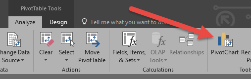  

## Clean Up
To clean up after this demo perform the following steps:
1.  Delete the resource group that contains your HDInsight cluster.