# Vehicle Telemetry Analytics Demo
This guide provides steps to setup and demonstrate a connected car scenario with Cortana Analytics.

## Pre-Requisites
This section lists the pre-requisites required for this demonstration.
- An Azure subscription
- Visual Studio 2015
- PowerBI Desktop - <https://powerbi.microsoft.com/en-us/desktop>

## Setup
*Estimated time: 45 minutes*
1.  Visit <https://gallery.cortanaintelligence.com/SolutionTemplate/Vehicle-Telemetry-Analytics-2> and click **Deploy. **
2.  On the next page, provide a solution name and a subscription.
3.  Provide an Azure SQL Database username and password and click **Deploy**.

   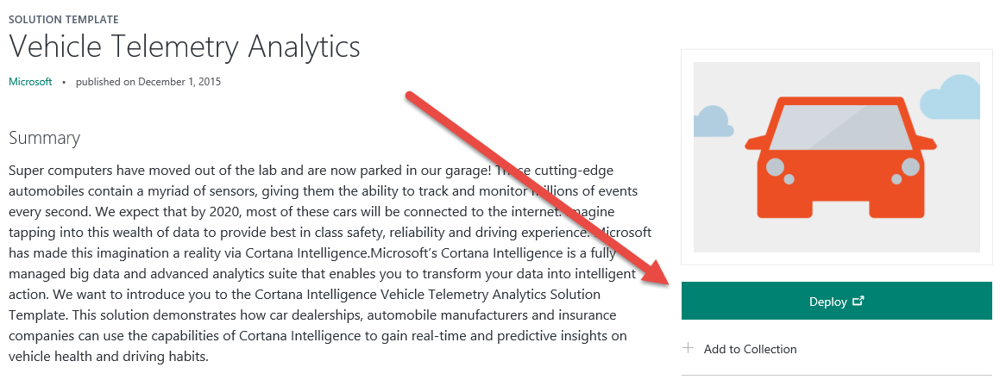

4.  Once deployed, click on the **Vehicle Telematics Simulator node** in the solution template, then click **Download**. The downloaded project contains all of the settings for your newly deployed environment and should not require any changes from you.

   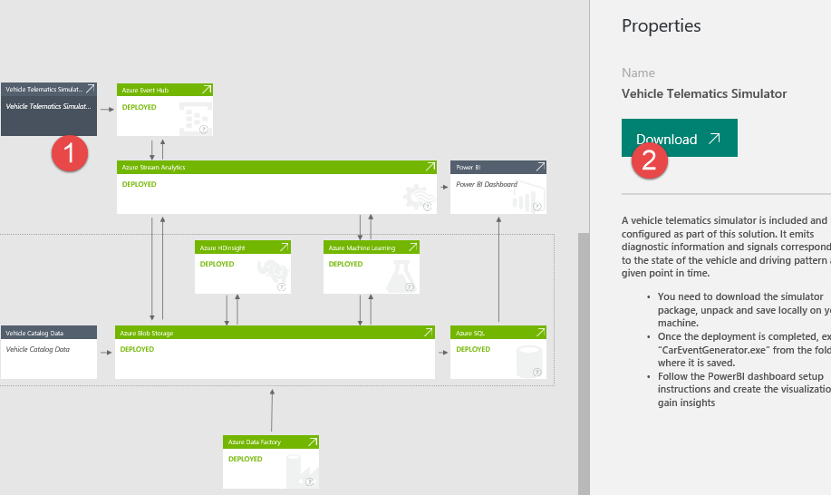

5.  Extract the package contents to a local folder.

   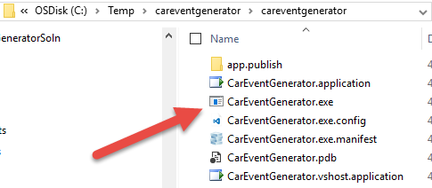

6.  Execute CarEventGenerator.exe to start generating load.

   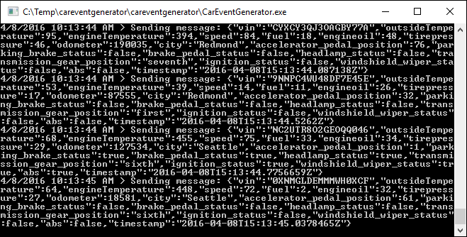

7.  Click on the Power BI node in the solution template.

   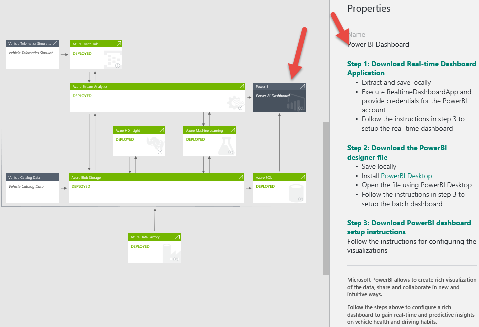

8.  **Download** the real-time dashboard application (step 1 in the properties pane on the right).
9.  **Execute** the RealtimeDashboardApp.

   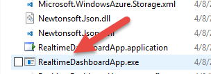

10.  You are prompted to log in, then authorize the app to write data to Power BI data sets. Click Accept.

   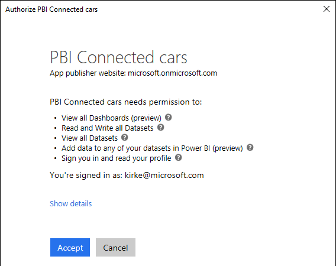

11. Click on the Power BI node in the solution template.

   

12. Download the PowerBI designer file (step 2 in the properties pane on the right).
13. **RENAME** the downloaded .zip file with a **.PBIX** extension.

   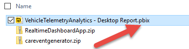

14. Open the file using PowerBI Desktop (<https://powerbi.microsoft.com/en-us/desktop>).

   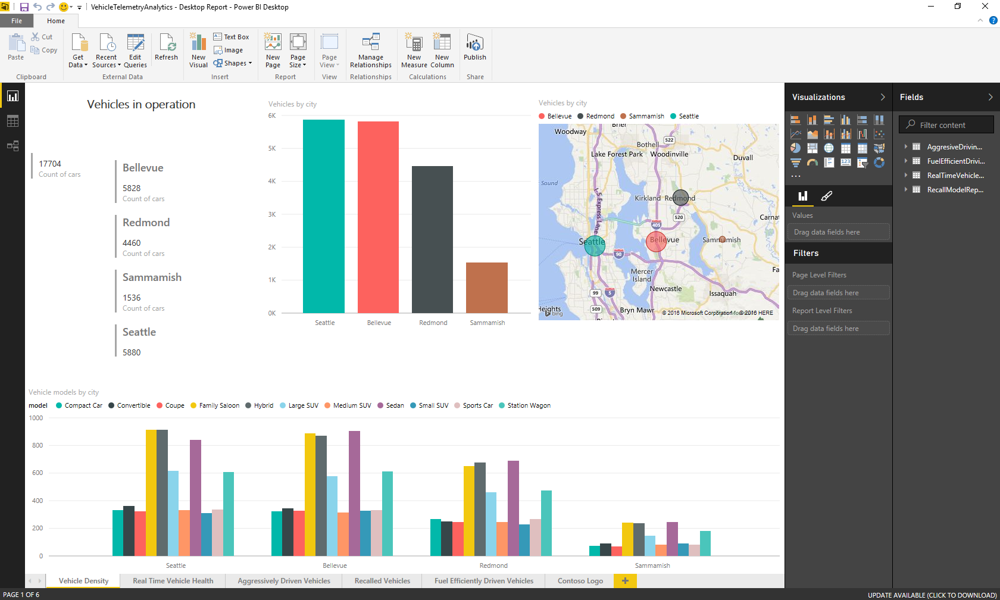

15. Click on the Power BI node in the solution template.

   

16. **Download** the PowerBI dashboard setup instructions to create the real-time and batch mode PowerBI dashboards.

   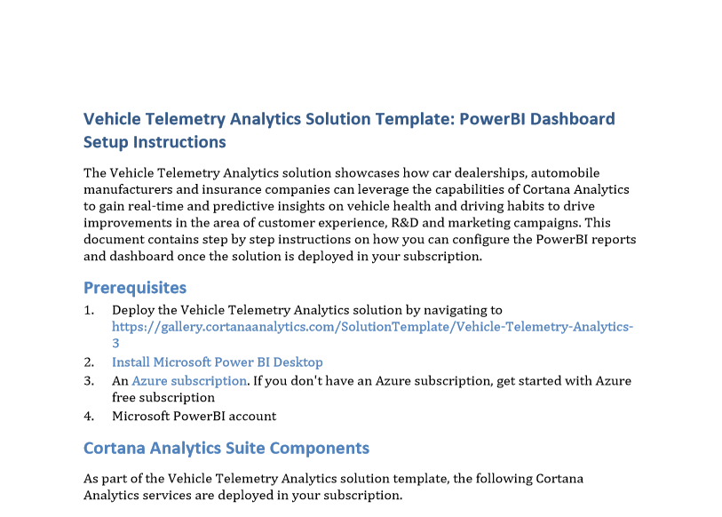

## Demo Steps
*Estimated time: 10 minutes*
1. Start out by showing the completed Power BI dashboard that was previously setup, giving an overview of the charts on the dashboard.

   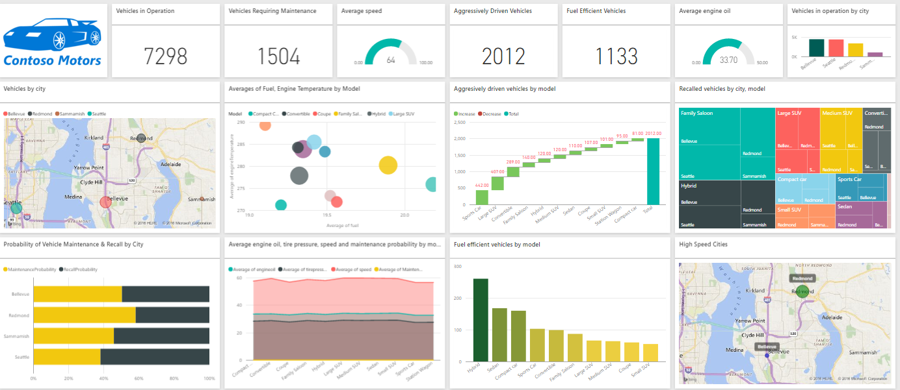

2. Then jump into the Aggressive Drivers dashboard. Describe how it makes sense that sports cars are statistically the most aggressive drivers.

   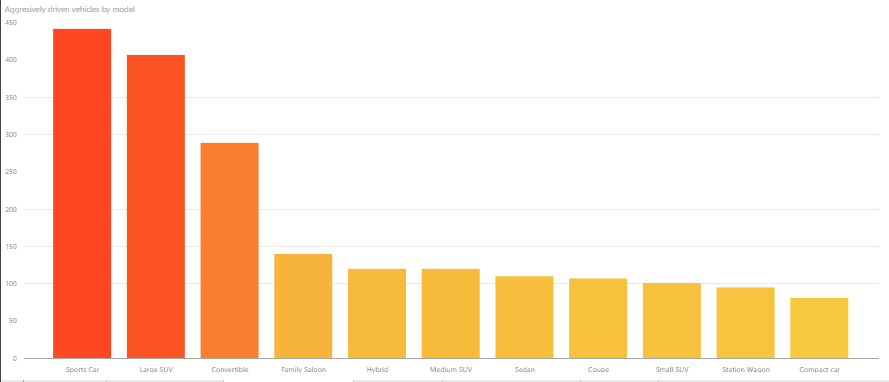

3. Go back to the main dashboard and then drill into the Vehicles Requiring Maintenance. Explain that through machine learning we can predict which vehicles are likely to need maintenance or a recall.

   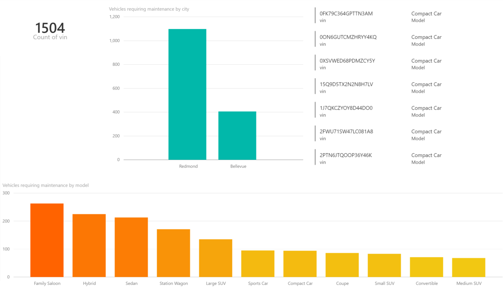

4. Go to the Azure Portal for the account you used to create the telemetry demo and open the Resource Group called “telemetrydemo\_*&lt;UniqueID&gt;*” that was created for you, and then open up the Data Factory resource called “telemetrydemo&lt;UniqueID&gt;”.

   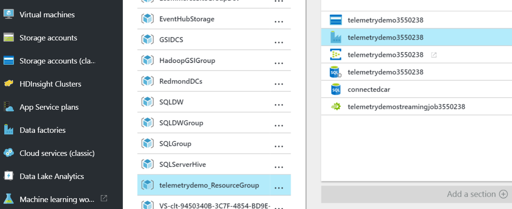

5. Click on the Diagram button to bring up the ADF diagram view, then zoom out and describe the overall layout of activities, pipelines and data sources like Blob Storage / SQL Database.
                                                                                                                     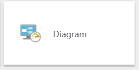
   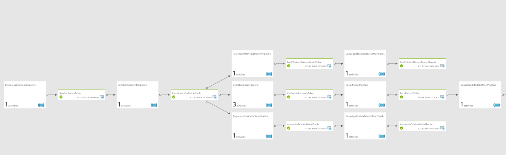

6. Zoom back in and click on the first node: PrepareSampleDataPipeline, and then click on the PrepareSampleDataActivity at the bottom in the Details list to show the JSON which shows the “type” and “typeProperties” of the .Net activity and .dll file which generates the simulated data. Describe the this will then create an output to the RawCarEventsTable that we see in the Diagram after this first item. Describe that in this JSON view you can see all the Datasets, Linked Services and Pipeline definitions built from JSON properties.

   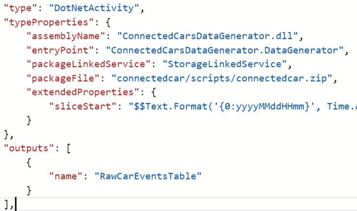
   
7. Go back to the Diagram view and double click on the AggressiveDrivingPatternPipeline node and then click on the Hive Activity in the Details list. Then click on the Activity Script button to view the

   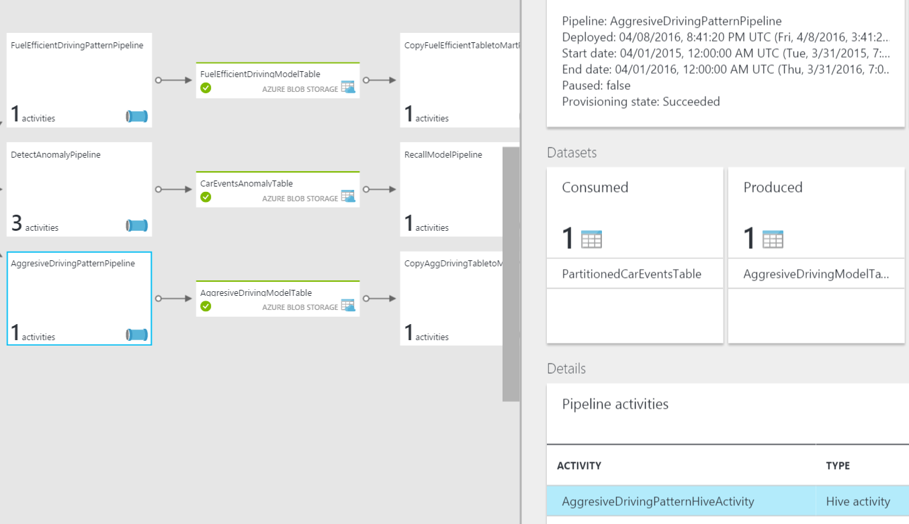

8. Then click on the Hive Activity button to view the Hive queries. Highlight the bottom query that shows how we find all the aggressive drivers by those going faster than 50 mpg in a higher gear that are slamming on their brakes. Note that it’s not just a regular brake, but a hard brake that was detected.

   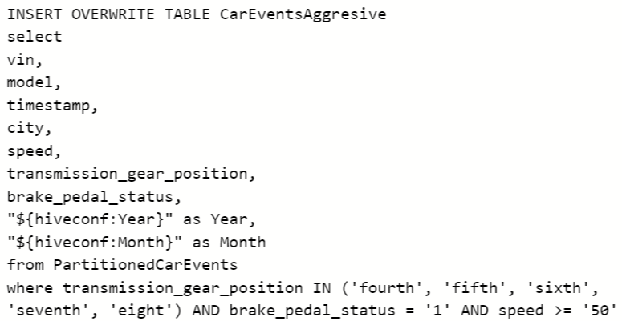
   
9. Go back to the main Diagram view and double click on the DetectAnomalyPipeline node, and click on the Pipeline source button. Scroll down to the AzureMLBatchScoring type and describe the ML activity, then click on Linked services at the top of the tree view and choose AzureMLAnomalydetectionendpoint. Show the endpoint for the Azure ML web service.

   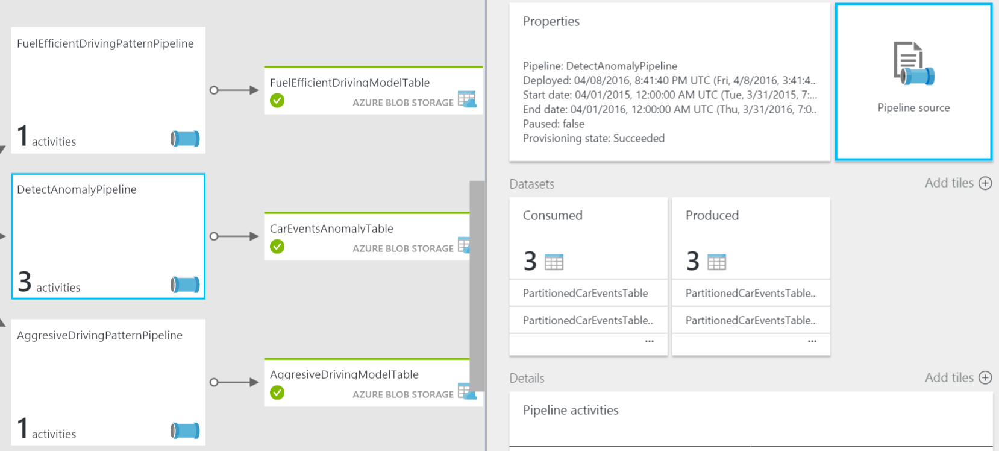

10. Navigate to <https://studio.azureml.net/> and sign in using the same account that was used when creating the solution template. Minimize the black popup and then make sure you are in the telemetrydemo\_workspace by looking in the workspace drop-down at the top of the page.

   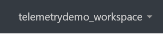

11. Navigate to the Experiments on the left menu and click on the first “Connected Car AML-V2 NoReader” item.

   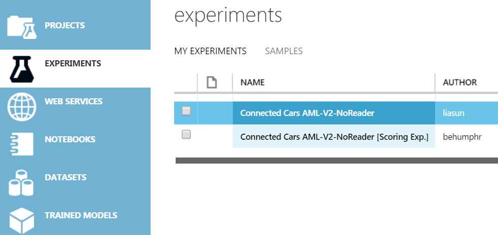

12. Click on the Trained Experiment tab and describe the basics of Azure ML by pointing out the visual designer flow and the left-hand options to build the workflow. Then mention that this is how the maintenance and recall machine learning is built, and uses a PCA-Based Anomaly Detection algorithm, which is good for when you don’t have a lot of bad data to train but can instead find outliers from good data.

   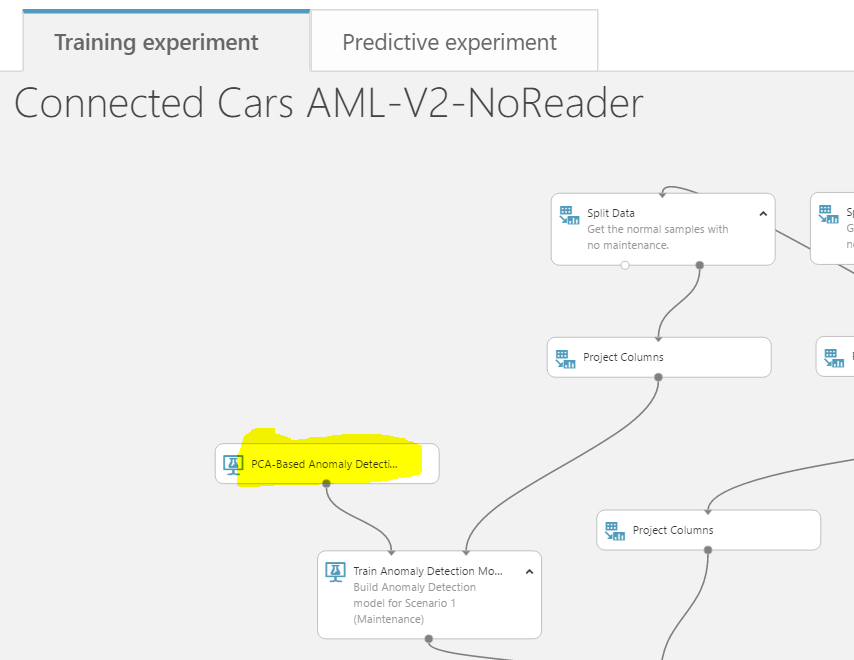

13.  Click on the Predictive experiment tab at the top and describe that after you train a model you then create a web service and set the input and outputs. You then publish that web service, which is what is what we showed in ADF.

   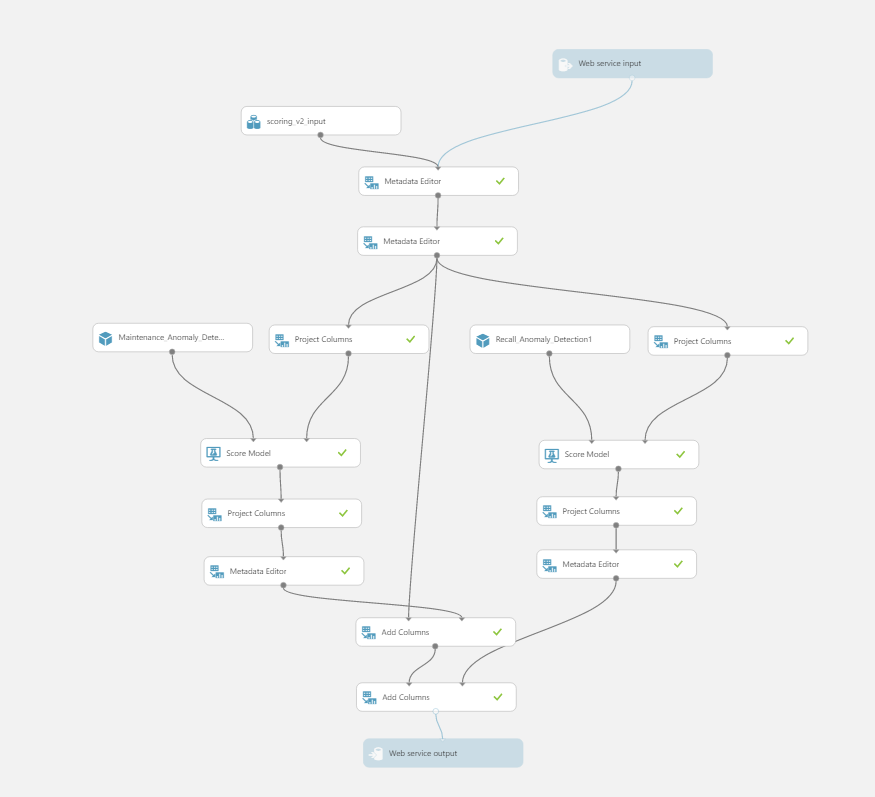

14. Go back to the Azure Portal and find the Stream Analytics job named “telemetrydemostreamingjob&lt;UniqueID&gt;”. Click on that and then open up the Query view to see the SQL statements. Describe the SQL and show that we are ingesting data from an Event Hub and VIN data from Blob Storage, then pushing it out to Blob Storage, another Event Hub and a tumbling window into SQL Server. Click on Input and Outputs and show the Blob Storage / SQL Server / Event Hub data sources.

   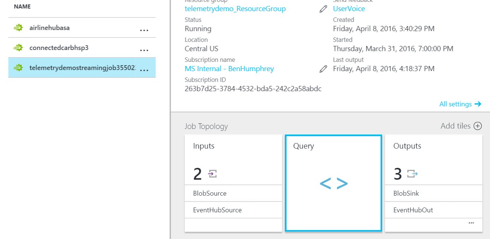

15. Run the careventgenerator.exe application that was downloaded from the solution template to start simulating events, then run the RealTimeDashboardApp.exe application to start processing the ML on the events.

   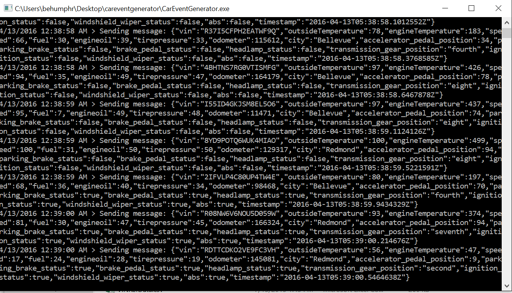
   
16. Go back to Power BI on the main Dashboard and watch the real-time data change as the events are processed.
17. Show them that if they want to try out this demo themselves they can go to <https://gallery.cortanaintelligence.com/SolutionTemplate/Vehicle-Telemetry-Analytics-2>.

## Clean Up
To clean up after this demo perform the following steps:

1. Delete the resource group that contains your HDInsight cluster.